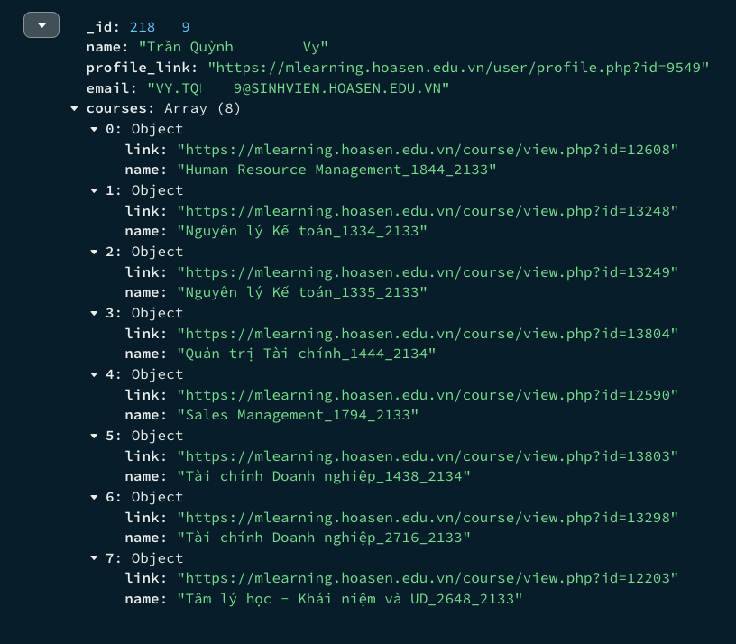

# Student Data Scraping

This project involves extracting information from students who have attended the same class as me on MLearning, a learning management platform utilized by my university. In addition to gathering data related to the students' accounts, the project aims to retrieve details about the courses they have taken. All collected data will be stored within a single MongoDB collection.

## Result

After a long time of scraping, in my valid **22 courses**, I have **632 unique classmates**. This is a document representing the data of a classmate I got from scraping:

> The data is partially obsured.

## What improvements are needed?

It's evident that the **`README.md`** needs improvement. I'll revisit it along with the main program to enhance clarity and effectiveness in explaining how the program operates. Additionally, I intend to conduct statistical analysis and create visualizations based on the scraped data.